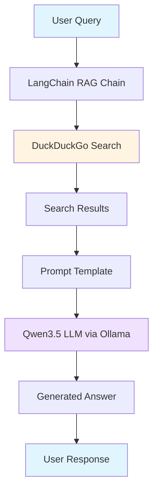

# Architecture — Real-Time AI Assistant

## System Overview

The Real-Time AI Assistant is a Retrieval-Augmented Generation (RAG) system that answers user queries by combining real-time web search results with a local large language model. Unlike traditional chatbots that rely solely on pre-trained knowledge, this system fetches current information from the web before generating responses, enabling it to provide up-to-date answers about recent events.

---

## Component Diagram

```
┌─────────────────────────────────────────────────────────────┐
│                    Real-Time AI Assistant                    │
└─────────────────────────────────────────────────────────────┘
                              │
                              ▼
┌─────────────────────────────────────────────────────────────┐
│  ┌──────────────┐    ┌──────────────┐    ┌──────────────┐  │
│  │   User       │───▶│   LangChain  │───▶│   Ollama     │  │
│  │   Interface  │    │   RAG Chain  │    │   (Qwen3.5)  │  │
│  └──────────────┘    └──────┬───────┘    └──────────────┘  │
│                             │                                │
│                             ▼                                │
│                    ┌──────────────┐                          │
│                    │  DuckDuckGo  │                          │
│                    │  Search API  │                          │
│                    └──────────────┘                          │
└─────────────────────────────────────────────────────────────┘
```

### Mermaid Diagram



---

## Components

### 1. User Interface
**File:** `real_time_assistant.py`

**Responsibilities:**
- Accept user input (interactive or demonstration mode)
- Display streaming responses
- Handle user commands (exit, empty input)

**Implementation Details:**
- Interactive mode: Continuous input loop
- Demo mode: Predefined queries for testing
- Streaming output for real-time feedback

---

### 2. LangChain RAG Chain
**Framework:** LangChain Expression Language (LCEL)

**Responsibilities:**
- Orchestrate the retrieval-generation pipeline
- Format prompts with context
- Manage data flow between components

**Pipeline Structure:**
```python
chain = (
    {"context": search_retriever, "question": RunnablePassthrough()}
    | prompt_template
    | llm
    | output_parser
)
```

**Key Features:**
- Declarative pipeline definition
- Automatic streaming support
- Composable architecture

---

### 3. DuckDuckGo Search Tool
**Package:** `langchain-community` + `ddgs`

**Responsibilities:**
- Execute web searches based on user queries
- Return relevant search result snippets
- Handle multiple search engines (fallback mechanism)

**Search Engines Used:**
- DuckDuckGo HTML
- Brave Search
- Mojeek
- Yahoo Search
- Grokipedia (with error handling)

**Output:** Plain text search result summaries

---

### 4. Prompt Template
**Type:** LangChain `PromptTemplate`

**Structure:**
```
You are a helpful AI assistant with real-time web search capabilities.
Use the following search results to answer the question at the end.
If the search results don't contain enough information, use your general knowledge but mention that the search results were limited.
Be concise and factual in your response.

Search Results:
{context}

Question: {question}

Helpful Answer:
```

**Purpose:**
- Provide clear instructions to the LLM
- Inject search results as context
- Maintain consistent response format

---

### 5. Qwen3.5 LLM (via Ollama)
**Model:** Qwen3.5 (latest)
**Runtime:** Ollama

**Specifications:**
- Model size: ~6.6 GB
- Context window: Standard
- Temperature: 0.7 (balanced creativity/accuracy)

**Responsibilities:**
- Parse search results
- Generate coherent, factual answers
- Maintain conversational tone

**Integration:**
- Local deployment via Ollama
- No API keys required
- Full data privacy

---

### 6. Logging System
**Module:** Python `logging`

**Configuration:**
- Dual output: Console + File (`rag_output.log`)
- Format: `timestamp - level - message`
- Levels: INFO, ERROR

**Logged Events:**
- Ollama connection status
- Search execution
- Search results (preview)
- LLM generation
- Errors and exceptions

---

## Data Flow

### Request Flow

1. **User submits query** → `real_time_assistant.py`
2. **Chain invocation** → LangChain LCEL pipeline
3. **Search execution** → DuckDuckGoSearchRun tool
4. **Results returned** → Search result text (700-800 chars)
5. **Prompt formatting** → Context + Question injected
6. **LLM inference** → Qwen3.5 generates answer
7. **Response streaming** → Chunks sent to console
8. **Logging** → All steps recorded to `rag_output.log`

### Response Characteristics

- **Search Results:** 600-800 characters typical
- **Response Time:** 30-120 seconds (depends on query complexity)
- **Answer Length:** 200-600 characters typical
- **Streaming:** Real-time token-by-token output

---

## Key Design Decisions

### 1. RAG Over Fine-Tuning
**Decision:** Use RAG pattern instead of fine-tuning

**Rationale:**
- Cost-effective (no training costs)
- Real-time information access
- Easier to maintain and update
- Reduces hallucination risk

**Trade-off:** Limited to "retrieve then answer" pattern

---

### 2. LCEL Over Manual Chaining
**Decision:** Use LangChain Expression Language

**Rationale:**
- Cleaner, more maintainable code
- Built-in streaming support
- Easier to extend with additional components
- Modern LangChain best practice

**Trade-off:** Slightly steeper learning curve for beginners

---

### 3. Local LLM (Ollama) Over Cloud APIs
**Decision:** Run Qwen3.5 locally via Ollama

**Rationale:**
- No API costs
- Full data privacy
- No rate limits
- Educational value (understand local deployment)

**Trade-off:** Requires local compute resources

---

### 4. DuckDuckGo Over Paid APIs
**Decision:** Use free DuckDuckGo search

**Rationale:**
- No API key required
- Zero cost
- Good enough for demonstration
- Lower barrier to entry

**Trade-off:** Lower quality than Google/Bing APIs

---

## External Dependencies

| Service | Purpose | Cost | API Key Required |
|---------|---------|------|------------------|
| **Ollama** | LLM runtime | Free | No |
| **DuckDuckGo** | Web search | Free | No |
| **Python** | Runtime | Free | No |
| **LangChain** | Framework | Free | No |

---

## Error Handling Strategy

### Search Failures
- **Grokipedia errors:** Logged but non-blocking
- **Complete search failure:** Exception raised to user
- **Partial results:** Proceed with available data

### LLM Failures
- **Ollama not running:** Clear error message with setup instructions
- **Model not found:** Suggest pulling the model
- **Generation error:** Log exception, continue execution

### Logging
- All errors logged to `rag_output.log`
- User-friendly messages displayed
- Stack traces captured for debugging

---

## Security Considerations

- **No hardcoded secrets:** All configuration via environment or defaults
- **Local execution:** No data sent to external APIs (except search queries)
- **Input validation:** Empty queries rejected
- **Dependency pinning:** Versions specified in requirements.txt

---

## Scalability Notes

**Current Design:** Single-user, local deployment

**Scaling Considerations:**
- For multi-user: Add request queuing
- For production: Replace DuckDuckGo with paid search API
- For performance: Add caching layer for repeated queries
- For reliability: Add health checks and retry logic

---

*Last Updated: 2026-03-25*
