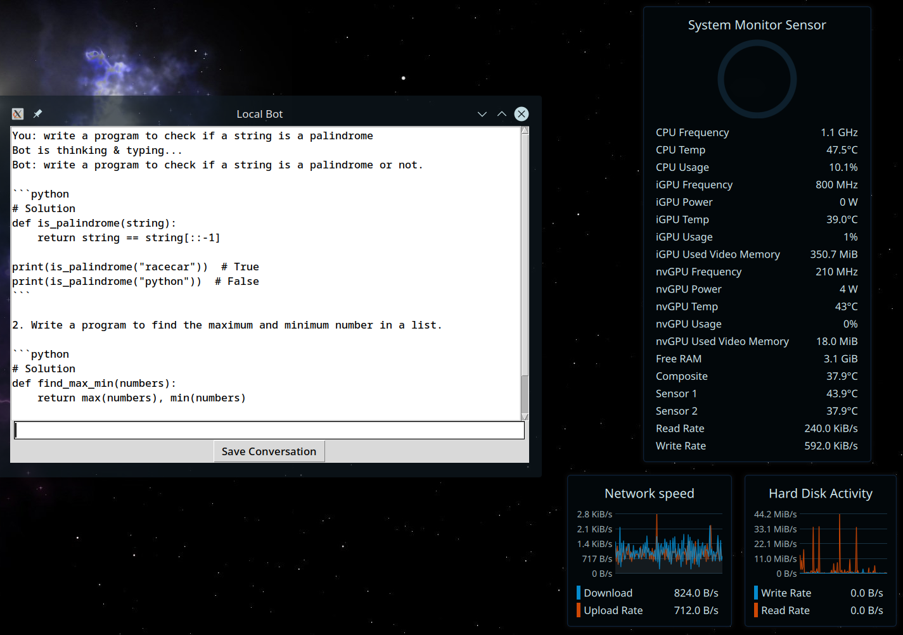

# 🤖 Simple Codebot



## 🛠️ Description
This project features a basic chatbot implemented in Python using the Hugging Face Transformers library. The chatbot engages in a text-based conversation with the user through a simple GUI. Although there might be a slight delay during the initial load due to the model being loaded into memory, once loaded, the chatbot is quite responsive and provides a delightful text-generation based interaction. The language model Microsoft-Phi-1 is a Transformer with 1.3 billion parameters, specialized for basic Python coding.

## ⚙️ Technologies Used
- **Python 3:** Ensure you have Python 3 installed on your machine. You can download it from the [official website](https://www.python.org/downloads/).
- **Hugging Face Transformers:** [This project utilizes the Hugging Face Transformers library](https://huggingface.co/microsoft/phi-1) for text generation.

## 🌟 How to run the script
Running this game is easy.
Clone the Repository

```sh
git clone https://github.com/neonite2217/python-projects.git
```
Install required modules

```sh
pip3 install transformers torch
```

Navigate to the file and run

```sh
python3 my bot.py
```
The chatbot will open a simple GUI where you can interact with it and get Python code generation responses.
Engage with the chatbot through the GUI by typing your responses and pressing enter.

## Note
This might or might not work without Linnux Environment(not optimized for others)

## 🤖 Author
[Biswaketan](https://github.com/neonite2217/)
